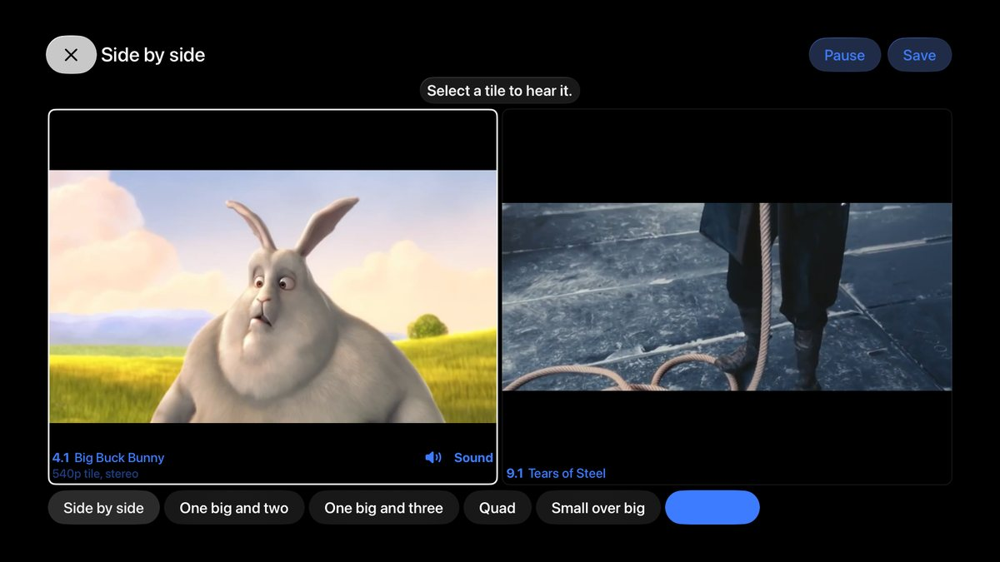
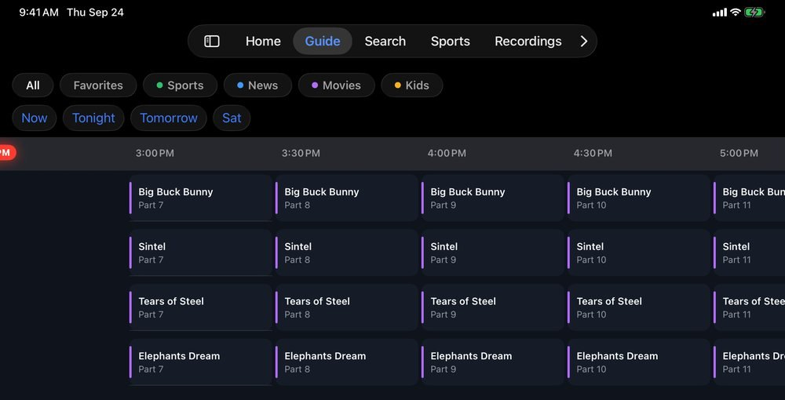
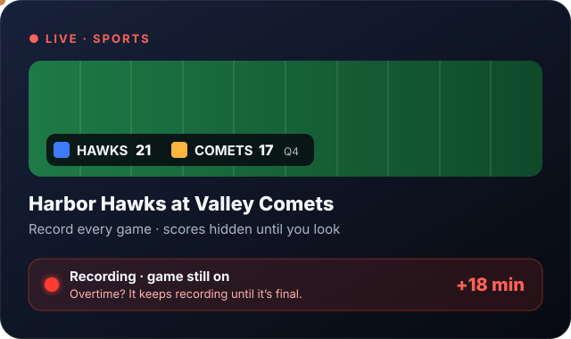

<p align="center">
  
</p>

<p align="center">
  <a href="https://github.com/wolfebase/broadwave/actions/workflows/ci.yml"></a>
  <a href="https://github.com/wolfebase/broadwave/pkgs/container/broadwave"></a>
  <a href="LICENSE"></a>
  
</p>

<h3 align="center">
  Your antenna already pulls in dozens of channels for free.<br>
  Broadwave puts them on every screen in your house — live, recorded, and in sync.
</h3>

<p align="center">
  <a href="#-install-in-60-seconds"><b>Install in 60 seconds</b></a> &nbsp;·&nbsp;
  <a href="#-see-it"><b>See it</b></a> &nbsp;·&nbsp;
  <a href="#-everything-it-does"><b>Features</b></a> &nbsp;·&nbsp;
  <a href="#-works-with"><b>Works with</b></a> &nbsp;·&nbsp;
  <a href="#-questions"><b>FAQ</b></a>
</p>

<p align="center">
  
</p>

<p align="center">
  
</p>

---

## ✦ One tuner. Every screen. The same frame.

Plug an antenna into a network tuner like an HDHomeRun, run Broadwave on any always-on box, and every iPhone, iPad, Apple TV, and browser in the house becomes a TV. No cable bill. No streaming subscription. No account. Just the broadcasts that are already in the air, looking better than they ever have.

<p align="center">
  
</p>

Three people watching the game in three rooms use **one** tuner, not three — and the kitchen never cheers three seconds before the living room.

---

## ✦ See it

<table>
  <tr>
    <td width="50%" valign="top">
      
      <h3>Live TV that looks like it should</h3>
      Real 60-frame motion from 720p broadcasts, film restored to its native 24p, hardware-accelerated on an Intel or AMD iGPU, and 5.1 surround passed straight through to your Apple TV. A built-in stream panel shows exactly what's happening, frame for frame.
    </td>
    <td width="50%" valign="top">
      
      <h3>Multiview, everywhere</h3>
      Side by side, one big and three, quad, or picture-in-picture — on Apple TV, iPad, iPhone, and the web. Sound follows whichever tile you pick. Save your favorite layouts for game day.
    </td>
  </tr>
  <tr>
    <td width="50%" valign="top">
      
      <h3>A guide worth scrolling</h3>
      Up to 14 days of listings with artwork, season and episode, premieres, and finales. Jump to Now, Tonight, or Tomorrow. Search titles, descriptions, and cast across the whole guide and your recordings.
    </td>
    <td width="50%" valign="top">
      
      <h3>A DVR that understands sports</h3>
      Follow a team and every game records itself. Overtime? Broadwave keeps recording until it's final. Live scores on the guide and the player — or hide them, so a recording never spoils itself.
    </td>
  </tr>
</table>

---

## ✦ Install in 60 seconds

You need an always-on computer (Linux, Unraid, a NAS, or a mini PC) and a network TV tuner such as a [SiliconDust HDHomeRun](https://www.silicondust.com/). The image runs on **x86-64 and ARM64**.

<details open>
<summary><b>🐳 Docker</b> — one command</summary>

```bash
docker run -d --name broadwave --network host --restart unless-stopped \
  -e TZ=America/Chicago \
  -v ~/broadwave:/config \
  -v ~/broadwave/recordings:/config/work/recordings \
  --device /dev/dri \
  ghcr.io/wolfebase/broadwave:latest
```

Open **`http://<your-server>:8477`**. Broadwave finds your tuner, scans your channels, and fills the guide on its own.

- `--network host` lets Broadwave find your tuner and lets the apps find Broadwave. Keep it.
- `--device /dev/dri` turns on Intel or AMD hardware transcoding. No GPU? Leave that line out.
- Set `TZ` to your time zone so the guide lines up.

</details>

<details>
<summary><b>🧩 Docker Compose</b></summary>

```bash
curl -fsSLO https://raw.githubusercontent.com/wolfebase/broadwave/main/deploy/docker/compose.yaml
docker compose pull && docker compose up -d
```

Edit `TZ` in `compose.yaml` first, and remove the `devices` lines if the machine has no Intel or AMD graphics.

</details>

<details>
<summary><b>🟧 Unraid</b></summary>

In the Unraid terminal:

```bash
wget -O /boot/config/plugins/dockerMan/templates-user/my-Broadwave.xml \
  https://raw.githubusercontent.com/wolfebase/broadwave/main/deploy/unraid/broadwave.xml
```

Then go to **Docker › Add Container**, pick **Broadwave** from the template list, check the recordings path, and hit **Apply**. (A Community Apps listing is on the way.)

</details>

<details>
<summary><b>📱 The apps</b></summary>

- **Web:** any browser, at `http://<your-server>:8477`. Nothing to install.
- **iPhone, iPad, and Apple TV:** Broadwave is in App Store review now. On the same Wi-Fi, the app finds your server by itself — no typing.

</details>

---

## ✦ Everything it does

<table>
<tr>
<td width="33%" valign="top">

**📺 Watch**
- Live TV on every screen, in sync
- One tune shared by everyone on a channel
- True 60 fps motion, film back at 24p
- GPU decode and encode (Intel/AMD VAAPI)
- 5.1 AC-3 passthrough, broadcast audio picked right
- Buffers tuned for phone, desktop, and TV
- Stream panel: resolution, frame rate, encoder, dropped frames, sync

</td>
<td width="33%" valign="top">

**⏺ Record**
- Record shows, series, or every game
- Original broadcast quality, untouched
- Sports recordings run until it's final
- Keeps a tuner free for recordings
- Survives restarts; resumes a show still on
- Spoiler-safe scores

</td>
<td width="33%" valign="top">

**🗓 Guide**
- Up to 14 days of listings
- SiliconDust, Schedules Direct, XMLTV, or straight from the broadcast
- Artwork, seasons, premieres, finales
- Full-text search across the guide and recordings
- Antenna and signal tools that say *Great, OK, Weak,* or *Lost*

</td>
</tr>
<tr>
<td valign="top">

**🧭 Setup**
- Finds your tuner by itself
- Under 90 seconds, no typing for HDHomeRun
- Setup doctor checks networking, GPU, disks, time zone, and permissions

</td>
<td valign="top">

**🏈 Sports**
- Live scores from twelve leagues
- Follow teams, record every game
- Sports hub: what's on now and how long is left

</td>
<td valign="top">

**🔒 Private by design**
- No account, no ads, no analytics
- Everything stays on your server
- Open source, Apache 2.0

</td>
</tr>
</table>

---

## ✦ Works with

| | |
| --- | --- |
| **Tuners** | SiliconDust HDHomeRun (several at once, with failover), and HDHomeRun-compatible devices by address |
| **Playlists** | M3U (file or URL, with `tvg-*` tags and its own guide), Xtream Codes |
| **Other servers** | tvheadend, Channels DVR, Threadfin, xTeVe, ErsatzTV, Dispatcharr, Antennas |
| **Free streaming channels** | Pluto and Samsung TV Plus through a FastChannels container |
| **Guide data** | SiliconDust, Schedules Direct, any XMLTV address, and the broadcast itself |
| **Screens** | iPhone, iPad, Apple TV, and any modern browser |
| **Servers** | Docker on Linux (x86-64 and ARM64), Unraid, and Macs for development |

---

## ✦ Questions

<details>
<summary><b>Does it cost anything?</b></summary>

No. Broadwave is free and open source, with no subscription, no account, and no ads. Over-the-air TV is free too; you need an antenna and a network tuner.
</details>

<details>
<summary><b>Which tuner should I get?</b></summary>

Any current SiliconDust HDHomeRun works out of the box, and Broadwave finds it by itself. Broadwave is developed against an HDHomeRun CONNECT DUO (ATSC 1.0).
</details>

<details>
<summary><b>Where does the content come from?</b></summary>

From your antenna. Broadwave doesn't provide, host, or stream any content itself; it plays the free broadcasts your own tuner receives, plus any playlists you add.
</details>

<details>
<summary><b>Do I need an Apple device?</b></summary>

No. The web app does live TV, the guide, recordings, and multiview in any modern browser. The iPhone, iPad, and Apple TV apps add native playback, surround sound, and the remote.
</details>

<details>
<summary><b>Will it get along with Plex, Jellyfin, or Channels?</b></summary>

Yes. Everyone watching the same channel shares one tune, and Plex, Jellyfin, or Channels can use it too. Broadwave keeps a tuner free for its recordings, and it can also use a Channels DVR server as a source.
</details>

---

## ✦ Build from source

You need Go 1.26+, Node 22+, and ffmpeg. On a Mac: `brew install go node ffmpeg`.

```bash
make run      # build the web app and run the server on :8477 with ./data
make dev      # API with CORS for Vite; then: cd web && npm run dev
make test
```

Server flags: `-addr :8477`, `-config data`, `-hdhr <tuner address>` (or `HDHR_HOST`). The project guide is [`AGENTS.md`](AGENTS.md), and [`docs/architecture.md`](docs/architecture.md) explains how it works.

## License

[Apache 2.0](LICENSE). ffmpeg and comskip run as separate programs under their own licenses; see [`NOTICE`](NOTICE). [Privacy policy](PRIVACY.md) · [Support](SUPPORT.md). Demo imagery is from the Blender Foundation's open movies (CC BY).

<p align="center">
  <br>
  <sub>Made in Kansas City by <b>Wolfe Up LLC</b>. The TV in the sky was always free.</sub>
</p>
