<p align="center">
  
</p>

<p align="center">
  <a href="https://github.com/wolfebase/broadwave/actions/workflows/ci.yml"></a>
  <a href="https://github.com/wolfebase/broadwave/releases/latest"></a>
  <a href="https://github.com/wolfebase/broadwave/pkgs/container/broadwave"></a>
  <a href="LICENSE"></a>
</p>

<h3 align="center">
  Your antenna already pulls in dozens of channels for free.<br>
  Broadwave puts them on every screen in your house — live, recorded, and perfectly in sync.
</h3>

<p align="center">
  <a href="#-install-in-one-command"><b>Install</b></a> &nbsp;·&nbsp;
  <a href="#-one-tuner-every-screen-the-same-frame"><b>How it works</b></a> &nbsp;·&nbsp;
  <a href="#-everything-it-does"><b>Features</b></a> &nbsp;·&nbsp;
  <a href="#-works-with"><b>Works with</b></a> &nbsp;·&nbsp;
  <a href="#-questions"><b>FAQ</b></a>
</p>

<p align="center"></p>

<p align="center"></p>

<p align="center">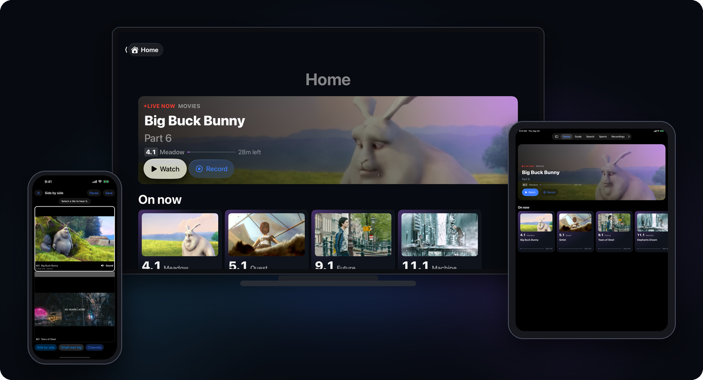</p>

<br>

## ✦ One tuner. Every screen. The same frame.

Plug an antenna into a network tuner, run Broadwave on any always-on box, and every phone, tablet, TV, and browser in the house becomes a TV. No cable bill. No streaming subscription. No account. Just the broadcasts that are already in the air, looking better than they ever have.

<p align="center"></p>

Three people watching the game in three rooms use **one** tuner, not three — and the kitchen never cheers three seconds before the living room.

<br>

## ✦ Everything it does

<table>
  <tr>
    <td width="50%">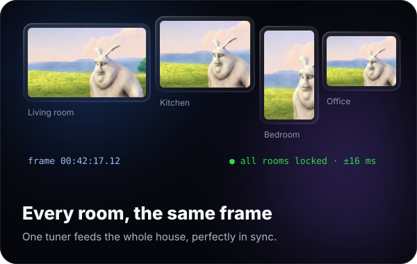</td>
    <td width="50%"></td>
  </tr>
  <tr>
    <td width="50%">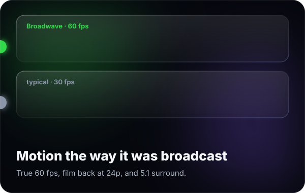</td>
    <td width="50%"></td>
  </tr>
  <tr>
    <td width="50%">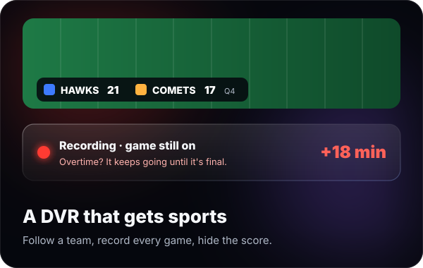</td>
    <td width="50%">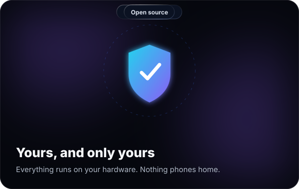</td>
  </tr>
</table>

<details>
<summary><b>The full list</b></summary>
<br>

| | |
| --- | --- |
| **Watch** | Live TV on every screen, in sync · one tune shared by everyone on a channel · true 60 fps, film restored to 24p · hardware transcoding on Intel and AMD graphics · 5.1 surround with a picker for languages and described video · buffers tuned for phones, desktops, and TVs · a stream panel that shows exactly what's happening |
| **Record** | Shows, series, or every game for your team · the untouched broadcast, in original quality · games keep recording until they're final · a tuner held back for recordings · a heads-up before live TV would take a recording's tuner · a later airing suggested when one can't record · nightly backups with one-tap restore |
| **Guide** | Up to 14 days of listings · guide data from your tuner's provider, Schedules Direct, XMLTV, or the broadcast itself · artwork, seasons, premieres, and finales · search across the guide and your recordings · antenna and signal tools that say *Great, OK, Weak,* or *Lost* |
| **Multiview** | Side by side, one-big-plus-three, quad, and picture-in-picture · sound and 60 fps follow the tile you pick · a Game Switcher that moves the big tile to the game that matters · saved layouts |
| **Sports** | Live scores for twelve leagues · follow teams and record every game · spoiler-safe scores you can hide |
| **Setup** | Finds your tuners, servers, and screens on its own · done in about 90 seconds · a setup doctor for networking, graphics, disks, time zone, and permissions · a banner when a new device shows up |
| **Private** | No account, no ads, no analytics · everything stays on your server · support bundles with secrets stripped out · open source, Apache 2.0 |

</details>

<br>

## ✦ Install in one command

<p align="center"></p>

You need an always-on computer that runs Docker — a NAS, a mini PC, or a home server — and a network TV tuner. The image runs on **x86-64 and ARM64**.

```bash
docker run -d --name broadwave --network host --restart unless-stopped \
  -e TZ=America/Chicago \
  -v ~/broadwave:/config \
  -v ~/broadwave/recordings:/config/work/recordings \
  --device /dev/dri \
  ghcr.io/wolfebase/broadwave:latest
```

Then open **`http://<your-server>:8477`**. Broadwave finds your tuner, scans your channels, and fills the guide on its own.

- **`--network host`** lets Broadwave find your tuner and lets your screens find Broadwave. Keep it.
- **`--device /dev/dri`** turns on Intel or AMD hardware transcoding. No graphics chip? Leave that line out.
- **`TZ`** is your time zone, so the guide lines up.

<details>
<summary><b>Docker Compose</b></summary>
<br>

```bash
curl -fsSLO https://raw.githubusercontent.com/wolfebase/broadwave/main/deploy/docker/compose.yaml
docker compose pull && docker compose up -d
```

Set `TZ` in `compose.yaml` first, and remove the `devices` lines if the machine has no Intel or AMD graphics.

</details>

<details>
<summary><b>Watch on</b></summary>
<br>

- **Any browser** at `http://<your-server>:8477` — live TV, the guide, recordings, and multiview. Nothing to install.
- **Native apps** for phones, tablets, and TVs find your server on the same Wi-Fi by themselves — no typing. With no server around, they play a built-in demo so you can try everything first.

</details>

<br>

## ✦ Works with

| | |
| --- | --- |
| **Tuners** | HDHomeRun and compatible network tuners — several at once, with automatic failover |
| **Playlists** | M3U (file or URL, with `tvg-*` tags and its own guide) and Xtream Codes |
| **Other TV servers** | tvheadend, Channels DVR, Threadfin, xTeVe, ErsatzTV, Dispatcharr, Antennas |
| **Free streaming channels** | Popular free ad-supported services through a FastChannels container |
| **Guide data** | Your tuner's guide, Schedules Direct, any XMLTV address, or the broadcast itself |
| **Screens** | Phones, tablets, TVs, and any modern browser |
| **Servers** | Anything that runs Docker, on x86-64 or ARM64 |

<br>

## ✦ Questions

<details>
<summary><b>Does it cost anything?</b></summary>
<br>No. Broadwave is free and open source — no subscription, no account, no ads. Over-the-air TV is free too; you need an antenna and a network tuner.
</details>

<details>
<summary><b>Where does the content come from?</b></summary>
<br>From your antenna. Broadwave doesn't provide, host, or stream any content itself; it plays the free broadcasts your own tuner receives, plus any playlists you add.
</details>

<details>
<summary><b>Which tuner should I get?</b></summary>
<br>Any current HDHomeRun works out of the box, and Broadwave finds it on its own. Other network tuners work by address.
</details>

<details>
<summary><b>Will it get along with the media servers I already run?</b></summary>
<br>Yes. Everyone watching the same channel shares one tune, and other media servers can use Broadwave as a tuner too. It keeps a tuner free for its own recordings.
</details>

<details>
<summary><b>What do I watch on?</b></summary>
<br>Whatever you have. The web app does everything in any modern browser, and the native apps add surround sound, remote control, and whole-home sync on phones, tablets, and TVs.
</details>

<br>

## ✦ Build from source

You need Go 1.26+, Node 22+, and ffmpeg.

```bash
make run      # build the web app and run the server on :8477 with ./data
make dev      # API with CORS for Vite; then: cd web && npm run dev
make test
```

Server flags: `-addr :8477`, `-config data`, `-hdhr <tuner address>` (or `HDHR_HOST`). [`docs/architecture.md`](docs/architecture.md) explains how it works, and [`docs/decisions/`](docs/decisions) records why.

## License

[Apache 2.0](LICENSE). ffmpeg and comskip run as separate programs under their own licenses; see [`NOTICE`](NOTICE). [Privacy](PRIVACY.md) · [Support](SUPPORT.md). Demo imagery is from the Blender Foundation's open movies (CC BY).

<p align="center">
  <br>
  <sub>Made by <b>Wolfe Up LLC</b>. The TV in the sky was always free.</sub>
</p>
