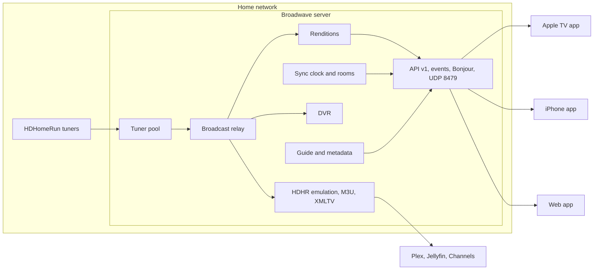

# Architecture

## Server (`server/`)

One Go binary. It embeds the web app, keeps its catalog in SQLite under `-config` (default `./data`), and writes live buffers and recordings under `<config>/work`.

### Tuning and the relay (`internal/hdhr`, `internal/live`)

- `hdhr` speaks the HDHomeRun protocols: UDP discovery on 65001, the TCP control channel (`/tunerN/vchannel`, `/tunerN/status`, `/tunerN/streaminfo`), and HTTP `discover.json`, `lineup.json`, `status.json`.
- `GET /api/v1/home` lists tuners, screens, and servers on the local subnet and does not add them. Apps announce themselves with a `here` message on the event socket. Plex, Jellyfin, Emby, and Channels get one action: copy this server's HDHomeRun address.
- `live.Hub.Watch` tunes a whole RF **frequency** (`/tunerN/ch<freq>` on port 5004), not a single subchannel. A `mux` reads that transport stream once and fans the bytes out to subscribers. Each subchannel on the frequency becomes a `feed` with its own ffmpeg process, so 14.1 through 14.16 can all play from one tuner.
- Viewers of the same channel share the same feed and HLS playlist. Recordings attach another subscriber that copies the original MPEG-TS to disk.
- Tuners are released 20 seconds after the last viewer leaves, or after 45 seconds without segment requests (a closed tab or a sleeping phone).
- Live HLS uses 2-second segments with `EXT-X-PROGRAM-DATE-TIME`, keeping about 90 minutes for rewind.
- Startup encodes three seconds of 1080p60 and keeps the speed. That measurement picks the tallest transcode and the selected tile: 720p60 and four tiles at 4× or faster, and 360p with one tile when the encode cannot hold real time. A copied broadcast is unchanged. One more picture than the budget allows is refused. The sentence is on Diagnostics.
- The first packets of a tune decide the scan type. A recording is that same transport stream, and library playback reads its headers the same way (the channel's stored scan is only the fallback). Progressive 720p stays 720p60 and is never deinterlaced. Interlaced video is deinterlaced to field rate (59.94). Film cadence plays at 24. Where the graphics chip is present, decode and encode stay on it (`h264_vaapi`, and `hevc_vaapi` tagged `hvc1` for Apple). AC-3 passes through when the device can play it. A true 30-frame show is not blended up to 60. The image's ffmpeg is jellyfin-ffmpeg, which is what makes that VAAPI path reliable.
- Multiview tiles use `540` and `360` renditions, including silent ones (`540.none`, `360.none`), so an unfocused tile does not transcode audio. `POST /api/v1/multiview/plan` says which channels fit on the tuners. Tiles in one session share a `multiview:<id>` sync room. See `docs/decisions/0004-multiview.md`.

**Next (relay v2):** a per-frequency ring buffer that live, recordings, and exports read from, and a master playlist so a quality or audio change never restarts the rendition. See `docs/decisions/0002-playback-pipeline.md` and `docs/decisions/0010-no-frame-interpolation.md`.

### Whole-Home Sync (`internal/sync`, planned)

A room per channel holds a target presentation time derived from segment program date-times. Clients measure their clock offset against the server over the events WebSocket and align playback to the room's target. A multiview session uses one room so every tile aims at the same wall-clock moment, and pause applies to all of them. See `docs/decisions/0003-whole-home-sync.md`.

### DVR (`internal/dvr`)

- `Plan` expands passes against the guide for 14 days and resolves conflicts by priority against the tuner count. Two airings on one channel need only one tuner.
- `Tick` runs every 20 seconds and starts recordings with padding.
- A crash leaves ffmpeg pid files in `work/pids`. The next start kills those processes, deletes `work/live`, and marks in-progress recordings failed. A show that is still on is recorded again for the time left. SIGTERM finishes the open recording and releases the tuner before exit.
- `OnSaved` runs commercial detection (comskip when installed, otherwise ffmpeg blackdetect) and writes EDL and JSON sidecars.
- Virtual (library) channels schedule recordings as a 24-hour channel without using a tuner.

### Guide (`internal/guide`)

The main source is the SiliconDust XMLTV feed, authenticated per request with the tuner's current `DeviceAuth`, which is never stored. A channel matches on its number, then its call sign (a trailing DT or HD still counts), and a guide match in Settings pins one listing when the names differ. Schedules Direct or an XMLTV link fills channels that feed does not publish. Channel logos and program images from that guide are cached at `/media/art/...`, and a movie artwork key in Settings fills posters the guide left blank. Season, episode, original air date, and a live flag are kept when the guide sends them. Search is a full-text index over those listings and over recordings. See `docs/decisions/0005-guide-sources.md`. Schedules Direct fills channels the feed misses, and M3U sources can bring their own XMLTV. After a successful pull the next one is scheduled at a random time 20–28 hours later (`nextGuidePull`). A failed pull retries in 30 minutes. A manual refresh is limited to once an hour. A restart waits out the stored deadline instead of pulling again.

### Sports (`internal/sports`)

Scores come from the public ESPN scoreboard for twelve leagues. F1 and NASCAR are schedules only. A live board refreshes every 30 seconds; a quiet board waits two hours. A failed fetch backs off and keeps the last good board. `GET /api/v1/sports/scoreboard` serves one league or the whole day. A listing is linked to a game when both teams (or the race name) appear in the title or subtitle and the start times are within 90 minutes. The id is stored on the airing and copied onto a recording of that listing. While the game is on, or late to start, the recording keeps going. It stops eight minutes after the game ends. A sports listing that did not match a game records an extra hour. Followed teams show on Home. Record every game is a team pass that matches the name on any channel. The activity log announces the next game once. Scores on the guide, the sports page, the player, and multiview come from that board. A matched game shows its colors, logos, and score, and how long is left. Hide scores in Settings blanks every result, and a recorded game stays blank until it is watched.

### Store (`internal/store`)

SQLite (WAL) through `modernc.org/sqlite`. Tables: devices, channels, airings, recordings, passes, markers, virtual channels, progress, settings, events, sources.

### HTTP (`internal/httpapi`)

JSON under `/api`, HLS under `/media`, the SPA at `/`. The optional HDHomeRun emulator on `:8478` exposes channels to other apps. The contract lives in `api/openapi.yaml`.

## Web app (`web/`)

React and Vite, built into `server/cmd/broadwave/assets/web` and embedded with `go:embed`. It plays HLS through hls.js and doubles as the setup and admin console. Side by side is `/multiview`: each tile has its own player, sound follows the focused tile, and the tiles share one multiview sync room.

## Apple apps (`apple/`)

SwiftUI apps for iOS and tvOS on shared packages: `BroadwaveKit` (API client, discovery, pairing, sync engine) and `BroadwaveUI` (theme and components). One channel plays in `AVPlayerViewController`. Side by side uses one `AVPlayer` layer per tile, sound and AirPlay follow the focused tile, and the tiles share a multiview sync room.

The apps browse Bonjour `_broadwave._tcp` (TXT `id`, `name`, `version`, `api`, `port`). After 3 seconds they also send a UDP probe `BWDP?` plus a 16-byte nonce to port 8479, as a broadcast and as a unicast to each address on the local subnet, so a server with Bonjour turned off is still found when another server already answered. The server answers only on local private interfaces, with `BWDP!` plus JSON `{"id","name","url","pub","sig"}`. The signature covers the nonce, the URL, and the id. The app stores the server's public key from `GET /api/v1/server`. It follows a new address only when that stored key verifies the reply and `GET /server` at the new address returns the same id and key. A matching id alone is not enough. Setup shows a QR code for `broadwave://connect?url=…`. Typing an address on Apple TV is the last step.

## Design tokens (`design/`)

`tokens.json` generates CSS variables for the web app and a Swift theme for the Apple apps, so both clients share one visual language.
