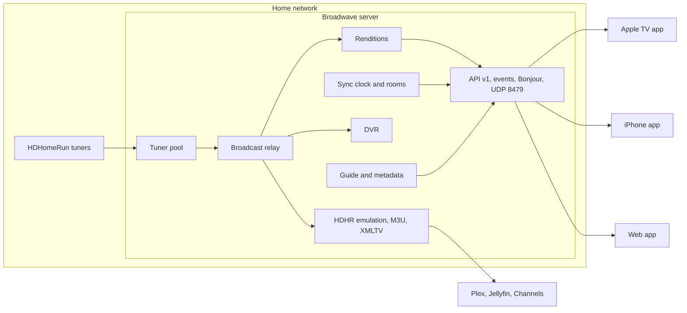

# Architecture

```mermaid
flowchart LR
  subgraph home [Home network]
    HDHR[HDHomeRun tuners]
    subgraph server [Broadwave server]
      TunerPool[Tuner pool]
      Relay[Broadcast relay]
      Renditions[Renditions]
      Sync[Sync clock and rooms]
      DVR[DVR]
      Guide[Guide and metadata]
      API[API v1, events, Bonjour, UDP 8479]
      Export[HDHR emulation, M3U, XMLTV]
    end
  end
  HDHR --> TunerPool --> Relay --> Renditions
  Relay --> DVR
  Renditions --> API
  Sync --> API
  Guide --> API
  Relay --> Export
  API --> TV[Apple TV app]
  API --> Phone[iPhone app]
  API --> Web[Web app]
  Export --> Others[Plex, Jellyfin, Channels]
```

## Server (`server/`)

One Go binary. It embeds the web app, keeps its catalog in SQLite under `-config` (default `./data`), and writes live buffers and recordings under `<config>/work`.

### Tuning and the relay (`internal/hdhr`, `internal/live`)

- `hdhr` speaks the HDHomeRun protocols: UDP discovery on 65001, the TCP control channel (`/tunerN/vchannel`, `/tunerN/status`, `/tunerN/streaminfo`), and HTTP `discover.json`, `lineup.json`, `status.json`.
- `GET /api/v1/home` lists tuners, screens, and servers on the local subnet and does not add them. Apps announce themselves with a `here` message on the event socket. Plex, Jellyfin, Emby, and Channels get one action: copy this server's HDHomeRun address.
- `live.Hub.Watch` tunes a whole RF **frequency** (`/tunerN/ch<freq>` on port 5004), not a single subchannel. A `mux` reads that transport stream once and fans the bytes out to subscribers. Each subchannel on the frequency becomes a `feed` with its own ffmpeg process, so 14.1 through 14.16 can all play from one tuner.
- Viewers of the same channel share the same feed and HLS playlist. Recordings attach another subscriber that copies the original MPEG-TS to disk.
- Each tuned frequency also keeps its last hour on disk by default (`internal/ring`, `work/ring`; Settings offers off, 30 minutes, 1, 2, or 4 hours, applied within 10 s, and Diagnostics shows what each ring holds): the multiplex as received, in one-minute files, with a once-a-second index of wall time to byte. Bytes enter the ring under the same lock and in the same order as the fan-out, and a slow disk never holds up the tuner (past 32 MB behind, the ring starts over). The ring takes at most half the free space it finds on its own disk and always leaves 4 GB, plus the recordings reserve when recordings share that disk; short of that it gives up its oldest files, and it stops until there is 1 GB of room again. No file is created or removed under the lock the read loop needs. It is deleted when the tune ends and at startup. A recording of a show already on starts from the show's beginning: it copies the ring from there outside every lock, then joins the live fan-out at the exact byte the copy reached (only bytes still in memory are copied under the fan-out lock), and its stop timer starts once it is live. A new export (M3U, HDHomeRun emulation) starts with the ring's last 3 s through the same hand-over, so the app on the other end has its probe and a keyframe at once. A new encode for a player (web or Apple) joining a room that plays 6 s or more behind live starts the same way, 4 s before the room's frame, and reads as fast as it encodes until it reaches the fan-out; it is dated from a running encode of the channel (it needs one), and the watch answers once its playlist holds the room's frame, so the player starts on that frame at once instead of holding its first picture for the gap (11-15 s behind an Apple screen). The player names its room in the watch (an Apple player lands near the frame and closes the rest with one seek). A reader still copying from the ring when the tune ends is closed instead of joining it.
- Tuners are released 20 seconds after the last viewer leaves, or after 45 seconds without segment requests (a closed tab or a sleeping phone). The 20 seconds make a flip back instant; when every tuner is busy, the one left longest ago goes to the new channel at once.
- A player may guess the next channel (`POST /watch/{id}/warm`: the web player sends it when a row in its Channels list keeps focus for 300 ms). The server starts that channel's picture only when its frequency is already tuned and the picture budget has a free slot, and never stops another picture for a guess. The one exception is an ATSC 3.0 channel the player takes as broadcast (copy): it always needs its own tune and takes 5-7 s cold, so a guess tunes it when another 3.0-capable tuner stays free afterwards (a guess nobody joined counts as free, since the new one replaces it). The device's answer (about 2 s) is awaited outside the hub lock so playlists keep flowing. One guess runs at a time, it counts no viewer, it is the first picture a real watch frees, and it stops after 20 seconds unless a watch joins it.
- Live HLS segments are fMP4 with no edit lists: the packager moves each track's start into its fragment decode times, so sound and picture line up in players that ignore edit lists (hls.js, Chrome) and in those that honor them (Safari, AVPlayer). An encode's first fragment drops sound from before its first picture, so every player's timeline starts on the picture the playlist dates.
- Each encode reads its program through a filter that also watches each stream's timestamps. A frame hours off the timeline is dropped. When the picture's clock really moves back (a station splice, a looping source), the encode starts again on the new timeline and feeds the same packager, so players see an `EXT-X-DISCONTINUITY` instead of a frozen playlist: ffmpeg keeps broadcast timestamps (`-copyts`) and would clamp every later packet of a copied track to the old high point.
- Live HLS segments start on a keyframe and run at least half a second, with `EXT-X-PROGRAM-DATE-TIME`. The playlist keeps about 90 minutes of media. Recordings play back as an MPEG-TS event playlist, and an export is the broadcast MPEG-TS.
- Captions: `internal/captions` decodes CEA-608 (CC1) from the broadcast's MPEG-2 user data or H.264 SEI on the tuner's multiplex, one reader per watched channel, with no extra ffmpeg. Each rendition folder also serves `main.m3u8` (a multivariant playlist with an English CC subtitles group, `CLOSED-CAPTIONS=NONE`), `captions.m3u8` (the video playlist's segments, dates, and breaks, without parts or blocking reload), and one `segNNNNN.vtt` per video segment, made on request. Cues are broadcast timestamps moved onto the encode's fMP4 clock by the packager's broadcast offset, and each file's `X-TIMESTAMP-MAP` is its video segment's start, so captions work on every encoder, including the GPU ones that drop A/53.
- Sound tracks: one full-size encode carries every measured sound track of the program, the main mix first and the others after it. A 540 or 360 picture, a silent rendition, and a playlist or URL source carry one sound. The folder serves views cut from the same fragments on request and shared across screens: `video.m3u8` is the picture and `audio-<id>.m3u8` is one track, with the stamped index's numbers, dates, parts, and blocking reload. The legacy names are cut to the picture and the main sound. `master.m3u8` lists those views in one audio group whose default is that encode's main sound. A watch with `caps.alternates` gets it as `mainPlaylist` only when the encode carries another sound and has no track of its own. A watch that asks for another language or for described video, and sends that cap, joins the main encode when the encode carries the track or the channel has none in that role. The web player fetches the master and its picture playlist first and answers hls.js's first two loads from those bodies, then switches sound with hls.js's audio option. The iPhone and Apple TV apps select the track on the AVPlayer item. See `docs/decisions/0012-demuxed-alternates-from-one-encode.md`.
- Startup encodes a 1080p60 test picture and keeps the speed (on the processor timed from the first frame out, which holds steady between restarts). That measurement picks the tallest transcode and how many pictures can run. At 4× or faster on a GPU, or 5.5× or faster on the processor, the tallest picture is 1080p, the large tile is 720p60, and four pictures can run. An Intel fixed-function encoder at 4× or faster allows six pictures. Below real time the budget steps down. One 360p tile is the bottom step, under 0.5× on a GPU or under 1.4× on the processor. A GPU bench that runs out of its 20 seconds keeps a 540p picture, a 360p tile, and one picture. A probe that fails before it encodes keeps a 1080p picture, a 720p tile, and two pictures. `docs/hardware.md` has the rows. A copied broadcast is unchanged. One more picture than the budget allows is refused. The sentence is on Diagnostics.
- The first packets of a tune decide the scan type. A recording is that same transport stream, and library playback reads its headers the same way (the channel's stored scan is only the fallback). Progressive 720p stays 720p60 and is never deinterlaced. Interlaced video is deinterlaced to field rate (59.94). Film cadence plays at 24. Where the graphics chip is present, decode and encode stay on it (`h264_vaapi`, and `hevc_vaapi` tagged `hvc1` for Apple). AC-3 passes through when the device can play it. A true 30-frame show is not blended up to 60. The image's ffmpeg is jellyfin-ffmpeg, which is what makes that VAAPI path reliable.
- Multiview tiles use `540` and `360` renditions, including silent ones (`540.none`, `360.none`), so an unfocused tile does not transcode audio. `POST /api/v1/multiview/plan` says which channels fit on the tuners. Tiles in one session share a `multiview:<id>` sync room. See `docs/decisions/0004-multiview.md`. A mosaic (`POST /api/v1/mosaic`, `/media/mosaic/<key>/`, MPEG-TS at `/export/mosaic/<key>`) is the other way: one ffmpeg reads 2 to 4 channels from their shared tunes (one program pipe per input, `pipe:3` and up), decodes them in software, stacks them on a 1920x1080 frame at 59.94 with the first channel's sound, and writes one HLS stream for screens that take one stream (AirPlay, older devices, other apps). It does not keep broadcast timestamps: each input starts near zero, so the tiles are as far apart as their first keyframes, and the mosaic's program date-times are its own, not a channel room's. It holds each channel the way an export does, takes two pictures of the budget, and ends when one of its tunes is stopped (a recording that needs the tuner, a device that left). Mosaics chosen with Add to other apps (the `exportMosaics` setting, up to 8 slots) are channels 990.1 and up in the M3U, XMLTV, and HDHomeRun exports; a removed one leaves its slot empty so the others keep their numbers in Plex and Channels, and the export routes play only listed mosaics.

See `docs/decisions/0002-playback-pipeline.md` and `docs/decisions/0010-no-frame-interpolation.md`.

### Whole-Home Sync (`internal/realtime`)

A room per channel holds a target presentation time derived from segment program date-times. Every encode of a channel gives a broadcast frame the same date: the packager keeps each encode's broadcast start from its edit lists, and a new encode anchors on a running one instead of on the wall clock. Clients measure their clock offset against the server over the events WebSocket and align playback to the room's target. Small drift is trimmed by playback rate around the room's own rate (a room eases at 0.975x back to its latency); a player that stalls on every rate change (Safari) keeps the room's rate, and past about 120 ms pauses for the drift when ahead and seeks forward when behind, leading the target by what its last seek cost. Apple pauses or seeks only past 400 ms, and that seek goes to 2 seconds past the target. The web engine otherwise does this past 400 ms, and seeks backward only when a group rewinds. A web player joining a room starts loading on the room's frame (half a second ahead, for its first fragment's load) instead of hls.js's live edge, so it neither holds its first frame for the gap nor seeks forward to catch up; it waits up to 800 ms for the room's state and falls back to the edge when the playlist does not hold the frame yet (a fresh tune, whose room waits on its first frame; a room on an encode that ran a while, such as a page coming back from the back/forward cache, waits only for the buffer it lacks). A room plays at one of three delays behind live (lowest 6 s, balanced 16 s, stable 20 s): the first screen's own default starts it, anyone in it can move it, and a room with an Apple screen stays at balanced or further back because AVPlayer holds back about 13 s from live (stable on a channel whose station sends groups of pictures longer than 1.5 s: its playlists advertise a target of at least 4 s, set once because AVPlayer drops a stream whose TARGETDURATION or PART-TARGET changes, and AVPlayer holds back three of them; the first tune that sees such a group stores it on the channel, so every later encode of it, a multiview tile included, starts at 4 s, and a twin of that station, another channel row the same tune serves, keeps the mark too). A multiview session uses one room so every tile aims at the same wall-clock moment, and pause applies to all of them. Watching together is a group room per channel (`group:ch<id>`): pause, rewind, scrub, and live are room commands, a scrub toward live stops where Live goes (the room's delay), a rewind stops a second after the oldest frame the rewinding screen holds, the room's state names the screens in it (`people`, from each socket's `here`), and `GET /api/v1/groups` plus a `groups.changed` event let a screen on the channel offer to join. Joining is per visit; a reload starts alone. See `docs/decisions/0003-whole-home-sync.md`.

Rooms live in server memory. Every `hello` carries a `boot` id for the server process, so a client can tell a restart from a dropped connection. Clients reconnect with jittered backoff capped at 5 s, join their rooms again (the first screen back creates the room), measure the clock again after a sleep or a return to the foreground, replace a socket that stays quiet across a sleep, and read the lists again after any reconnect because events sent meanwhile are gone. On a new `boot` the web player starts a new watch at once. The Apple player starts the new watch while the old item plays on from its buffer, and swaps when the new playlist can start or the old buffer is nearly empty, so a restart costs a short cut instead of a fresh-tune start on a frozen picture. `web/e2e/restart-drill.mjs` restarts the server (the harness process, or a container with `DRILL_CONTAINER=1`) under a browser and simulators and logs each screen's recovery.

### DVR (`internal/dvr`)

- `Plan` expands passes against the guide for 14 days and resolves conflicts by priority against the tuner count. Two airings on one channel need only one tuner.
- `Tick` runs every 20 seconds and starts recordings with padding. A pass also joins an airing already underway when its frequency has been tuned since the airing began (someone was watching it, or another channel on the same frequency): the recording starts from the buffer. An airing that already has a recording in any state, one the viewer stopped or one that failed, is not joined again.
- A crash leaves ffmpeg pid files in `work/pids`. The next start kills those processes, deletes `work/live`, and marks in-progress recordings failed. A show that is still on is recorded again for the time left. SIGTERM finishes the open recording and releases the tuner before exit.
- `OnSaved` queues the recording for the break scan (`dvr.BreakQueue`): one scan at a time, started only while nobody watches live TV (or after 3 h of waiting), and at startup and every 6 h it queues finished recordings in the recordings folder that were never scanned (`recordings.breaks_scanned`). A scan (`internal/breaks`) reads black frames, scene cuts, silences, and one small frame per second (station logo, picture prints) in one low-priority ffmpeg pass, runs comskip when the image has it (output in a temporary folder), and gives each break a confidence; players skip on their own only from 0.7 and offer the skip below it. Breaks are stored as markers and written to the `.edl` beside the file.
- The same queue listens to every finished recording, whatever its pass says about breaks: ffmpeg decodes the first 20 and last 10 minutes of sound at 8 kHz, and the server keeps 32-bit sound prints every 64 ms (`episode_prints`, with where the listing starts and ends in the file). A recording is compared with up to eight other recordings of its show (not with another airing of the same episode): a stretch of 8 s to 3 min they share near the start is the intro, near the end the end titles. Stretches inside breaks or in the padding do not count. `introStart`, `introEnd`, and `creditsStart` (the listing's end when no end titles were found) drive Skip intro and Up next; the first episode of a show is filled in when the second arrives.
- After a recording, the whole file is read once for its health (`internal/tshealth`): continuity and transport errors, lost sync, and lost time (a PCR jump of more than 2 s across lost packets). A recording that lost 5 s or broke up 60 times an hour is damaged: it no longer counts as having its episode, so a pass records the next airing (two damaged copies end the retries), and `GET /recordings/{id}/again` names that airing for Record it again.
- Clean-up (`dvr/storage.go`) removes only finished recordings inside the recordings folder that are not kept forever, were watched to the end or marked watched, and were not played in the last 6 hours; each one is read again just before it goes. Keep rules run when a recording is saved. An hourly pass removes recordings watched more than `deleteWatchedDays` ago. With `makeRoom` on, the same pass and `Hub.ensureSpace` (before a recording would be refused) remove the oldest watched recordings until the shortfall under the reserve is covered, counting the bytes removed rather than reading free space back; when every candidate together would not cover it, nothing is removed. Staging and the test harness never run clean-up.
- Virtual (library) channels schedule recordings as a 24-hour channel without using a tuner.

### Guide (`internal/guide`)

The main source is the SiliconDust XMLTV feed, authenticated per request with the tuner's current `DeviceAuth`, which is never stored. With no guide key, a channel matches on its number, then its name, then its call sign (a trailing DT, DT1, HD, TV, or LD still counts), and a guide match in Settings pins one listing when the names differ. Schedules Direct or an XMLTV link fills channels that feed does not publish. Channel logos and program images from that guide are cached at `/media/art/...`, and a movie artwork key in Settings fills posters the guide left blank. Season, episode, original air date, and a live flag are kept when the guide sends them. Search is a full-text index over those listings and over recordings. See `docs/decisions/0005-guide-sources.md`. Schedules Direct fills channels the feed misses, and M3U sources can bring their own XMLTV. After a successful pull the next one is scheduled at a random time 20–28 hours later (`nextGuidePull`). A failed pull retries in 30 minutes. A manual refresh is limited to once an hour. A restart waits out the stored deadline instead of pulling again.

### Sports (`internal/sports`)

Scores come from the public ESPN scoreboard for twelve leagues. F1 and NASCAR are schedules only. A live board refreshes every 30 seconds; a quiet board waits until its next game starts, at most two hours. A failed fetch backs off and keeps the last good board. `GET /api/v1/sports/scoreboard` serves one league or the whole day. A listing is linked to a game when both teams (or the race name) appear in the title or subtitle and the start times are within 90 minutes. The id is stored on the airing and copied onto a recording of that listing. While the game is on, or late to start, the recording keeps going. It stops eight minutes after the game ends. A sports listing that did not match a game records an extra hour. Followed teams show on Home. Record every game is a team pass that matches the name on any channel. The activity log announces the next game once. Scores on the guide, the sports page, the player, and multiview come from that board. A matched game shows its colors, logos, and score, and how long is left. Hide scores in Settings blanks every result, and a recorded game stays blank until it is watched. Once a minute the server compares the board with the last look and sends `game.alert` on the realtime socket when a followed team's game starts or a game reaches a close finish, only for a game airing on a channel this home gets, once per game and kind; a game that is recording or recorded and unwatched (or every game, with scores hidden) gets no close alert.

### Store (`internal/store`)

SQLite (WAL) through `modernc.org/sqlite`. Tables include devices, channels, airings, recordings, passes, markers, virtual channels and items, progress, settings, events, sources and their secrets, team follows, guide scans, channel signals, episode prints, and spots. The numbered migrations are the full list.

### HTTP (`internal/httpapi`)

JSON under `/api/v1`. The same routes are also mounted under `/api`. HLS is under `/media`, and the web app is at `/`. The optional HDHomeRun emulator on `:8478` exposes channels to other apps. The contract lives in `api/openapi.yaml`.

## Web app (`web/`)

React and Vite, built into `server/cmd/broadwave/assets/web` and embedded with `go:embed`. It plays HLS through hls.js and doubles as the setup and admin console. Side by side is `/multiview`: each tile has its own player, sound follows the focused tile, and the tiles share one multiview sync room.

## Apple apps (`apple/`)

SwiftUI apps for iOS and tvOS on shared packages: `BroadwaveKit` (API client, discovery, pairing, sync engine) and `BroadwaveUI` (theme and components). One channel plays in `AVPlayerViewController`. Side by side uses one `AVPlayer` layer per tile, sound and AirPlay follow the focused tile, and the tiles share a multiview sync room.

The apps browse Bonjour `_broadwave._tcp` (TXT `id`, `name`, `version`, `api`, `port`). After 3 seconds they also send a UDP probe `BWDP?` plus a 16-byte nonce to port 8479, as a broadcast and as a unicast to each address on the local subnet, so a server with Bonjour turned off is still found when another server already answered. Every server on a computer binds 8479 with `SO_REUSEPORT`, so each gets its own copy of the broadcast; a unicast probe reaches only one of them. The server answers only on local private interfaces, with `BWDP!` plus JSON `{"id","name","url","pub","sig"}`. The signature covers the nonce, the URL, and the id. The app stores the server's public key from `GET /api/v1/server`. It follows a new address only when that stored key verifies the reply and `GET /server` at the new address returns the same id and key. A matching id alone is not enough. Setup shows a QR code for `broadwave://connect?url=…`. Typing an address on Apple TV is the last step.

The tvOS Top Shelf is an app extension (`App/TopShelf`). It has no Bonjour or sync of its own: the app writes the current server's URL to a keychain group the two share (`SharedServer`, no App Group), and the extension reads `/channels`, the airings on now, `/recordings`, and `/frames` when the system asks. It shows games on now, favorite channels, and recordings to finish (`TopShelf.sections`), linking to `broadwave://watch/<id>` and `broadwave://recording/<id>`. The app asks the system to reload it whenever the app leaves the foreground.

The iPhone and iPad widgets (`App/Widgets`, WidgetKit) read the same keychain item: On now (favorite channels, or every channel on now without favorites), Your teams (followed teams' games with the scoreboard line), Recording now, and Up next (the schedule; conflicts stay listed, since the server marks them skipped). A row whose airing is recording or already planned says so instead of offering Record. Their rows come from `WidgetFeed`, and a timeline asks again at the next listing edge, at most 15 minutes out. A Record button runs `RecordIntent` in the extension, which adds a one-airing pass (the app's Record once), so a game keeps recording until it is final. The app reloads the widgets when it leaves the foreground.

## Design tokens (`design/`)

`tokens.json` generates CSS variables for the web app and a Swift theme for the Apple apps, so both clients share one visual language.
